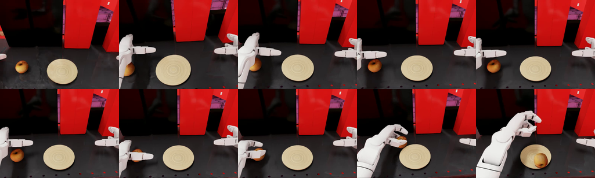

# 1. Baseline: the existing apple pick-and-place

Install the stack from scratch and run NVIDIA's published GR00T N1.7 policy on the stock Unitree G1
29-DoF with Dex3-1 hands. None of the code being run here is ours — the point is to prove the source
capability works on your machine and to produce the reference number every later step is measured
against.




| | |
|---|---|
| Task | `galileo_g1_static_pick_and_place` (IsaacLab-Arena) |
| Robot | Unitree G1 29-DoF, `g1_29dof_with_hand_rev_1_0.usd` |
| Hands | Unitree Dex3-1, 7 actuated joints per hand |
| Embodiment | `g1_wbc_agile_joint` |
| Policy | `nvidia/GN1x-Tuned-Arena-G1-Static-PickNPlace`, GR00T N1.7 (3B), frozen |
| Instruction | `"move the apple to the plate"` |
| Episode | 6.0 s, 50 Hz control |
| Success | `object_on_destination`: apple/plate contact, 0.5 N force, 0.1 m/s velocity |
| **Measured (fixed spawn, 6 s)** | **0.65 task success (13/20 episodes)** |
| **Measured (±5 cm spawn, 14 s)** | **0.30 task success (6/20 episodes)** — matched protocol for the fine-tune evals |

The ±5 cm / 14 s number is the fair Dex3 reference for step 5's Revo2 fine-tuned result (0.50 at
the same jitter and timeout). The fixed-spawn 0.65 remains the as-shipped baseline this step was
originally written around. Provenance for the jittered run:
`eval/g1_apple_mimic/rollouts_dex3_baseline_j05_20260911_165851`.

The lower body is held in a standing balance by the AGILE whole-body controller; the policy predicts
upper-body joint targets only and the robot never walks, so no locomotion controller enters the
comparison.

## Contents

| File | Purpose |
|---|---|
| `env.sh` | All paths, versions and task arguments. Every script sources this; it is the only file to edit. |
| `setup.sh` | One-time install: Docker images, both repos, the checkpoint, config wiring |
| `arena_run.sh` | Runs a command inside the Arena container with the right mounts |
| `run_policy_server.sh` | Starts the inference server on the host |
| `run_eval.sh` | The evaluation, printing success rate |
| `media/` | One recorded episode from this machine, as evidence the baseline works |

## Requirements

| | |
|---|---|
| GPU | NVIDIA, ~32 GB VRAM. Measured on an RTX 5090; the server takes 6.6 GB and the simulator the rest. |
| Disk | ~80 GB: 29 GB base image, 13 GB Arena image, 14 GB checkpoint, plus checkouts |
| Software | `docker` with the NVIDIA container runtime, `git`, `uv`, `huggingface-cli` |
| Account | An NGC account, for the Isaac Sim base image |

```bash
curl -LsSf https://astral.sh/uv/install.sh | sh      # if you do not have them
pip install -U "huggingface_hub[cli]"
```

## Install

```bash
docker login nvcr.io      # username is the literal string $oauthtoken, password is your NGC API key
./setup.sh
```

Roughly an hour, almost all of it downloading. Six steps, each skipped if already done, so a re-run
after a failure resumes rather than restarts:

1. Isaac Sim base image `nvcr.io/nvidia/isaac-sim:6.0.0-dev2`, ~29 GB
2. IsaacLab-Arena at `release/0.2.1`, with submodules
3. the `isaaclab_arena:latest` image, built with `INSTALL_GROOT=true`, ~20 min
4. Isaac-GR00T at pinned commit `4b1dca9`, and `uv sync` for its inference-server environment
5. the GR00T N1.7 checkpoint `nvidia/GN1x-Tuned-Arena-G1-Static-PickNPlace`, ~14 GB
6. rewriting `model_path` in the policy config to point at it

Everything lands under `~/g1_baseline`; override with `WORK_DIR`.

Two choices that are not obvious. **`release/0.2.1`, not `main`:** Arena's `main` has a Dockerfile
pointing at an internal NVIDIA registry that is not publicly pullable, so it cannot be reproduced
outside NVIDIA. **Isaac-GR00T is cloned separately** even though Arena vendors it as a submodule,
because the submodule is not pinned to the commit this checkpoint was validated against, and the
server needs its own environment on the host in any case.

## Run

Two terminals: the inference server runs on the host, the simulator in the container.

```bash
# terminal 1 — leave running
./run_policy_server.sh
```

Wait for it to report that it is listening; the 3B model takes about a minute to load.

```bash
# terminal 2
./run_eval.sh 100
```

The first ~4 minutes are Isaac Sim startup with no output. Expected tail:

```
FINAL METRICS: {'success_rate': 0.65, 'object_moved_rate': 0.65, 'num_episodes': 20}
```

At fixed spawn that is the as-shipped reference. The matched-protocol Dex3 number used against
the fine-tuned Revo2 result is **0.30 (6/20)** at ±5 cm spawn / 14 s
(`rollouts_dex3_baseline_j05_20260911_165851`).

[`media/baseline_episode.mp4`](media/baseline_episode.mp4) is one successful episode through the
robot's head camera, which is also the policy's own visual input. The filmstrip above is the same
episode: three-finger pinch, lift, place on the plate — the capability step 2 transfers.


