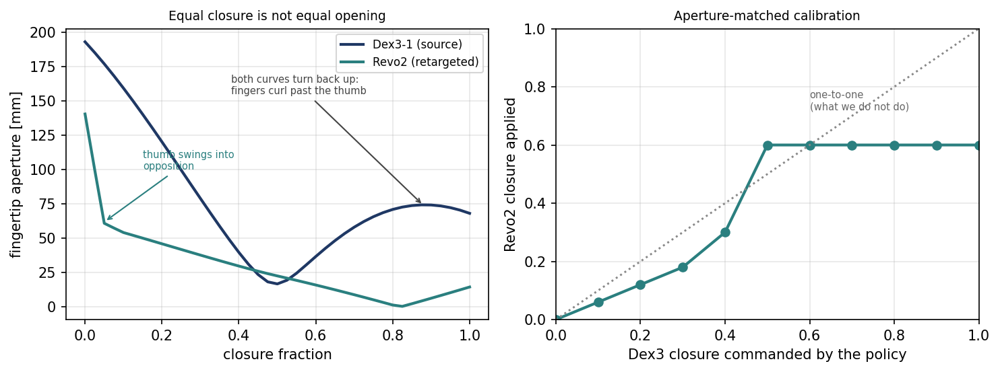

# 2. Retargeting: Dex3-1 to BrainCo Revo2 Touch

Swap the hands on the G1 and adapt the frozen policy's commands to fit them. The policy is never
modified — everything the swap demands is absorbed in one module at the action and observation
boundary, so the baseline and retargeted numbers differ by exactly one variable.

## How the mapping works

Pairing joints one to one is not possible. There are seven per hand on the Dex3 and six on the
Revo2, the flexion chains are different lengths, and the sign conventions disagree — Dex3 left and
right joints are mirrored and several have negative "closed" limits, while every Revo2 joint runs
from 0 (open) to positive (closed).

So nothing is mapped angle to angle. Each Dex3 joint is first expressed as a **closure fraction**,
0 at its open limit and 1 at its closed limit, which makes the two hands comparable without caring
about sign or range. Those fractions then collapse to a single number for the whole hand, and that
number drives all six Revo2 joints:

| Dex3 joints | Revo2 joint | How it is driven |
|---|---|---|
| `index_0`, `index_1` | `index_proximal` | two-joint flexion chain averaged into one closure |
| `middle_0`, `middle_1` | `middle_proximal` | same |
| `thumb_1`, `thumb_2` | `thumb_proximal` | thumb flexion pair averaged into one closure |
| `thumb_0` | `thumb_metacarpal` | no counterpart — a roll, not an opposition sweep. Driven by a geometric schedule instead. |
| — | `ring_proximal`, `pinky_proximal` | no source signal at all — follow the mean closure of index and middle |

Collapsing to one scalar is a decision rather than a shortcut. The Dex3 pinches as one unit in this
task, index, middle and thumb moving together, and the aperture calibration below was derived from a
uniform closure sweep — so driving the fingers independently would apply a calibration that was
never measured for the resulting pose.

The single closure is not passed through unchanged. It goes through the aperture calibration, and
the thumb follows its own schedule on top; both are covered next.

## What is used

| File | Purpose |
|---|---|
| `env.sh` | Paths and pinned versions. Every script sources this. |
| `setup.sh` | One-time install: Isaac Sim image, Arena checkout, Arena image |
| `build_asset.sh` | URDF → USD, then the corrections the converter needs |
| `install.sh` | Installs the embodiment into an Arena checkout |
| `analyze.sh` | Measures both hands and prints the tables. NumPy only, no simulator. |
| `hand_specs.py` | The measured constants, with sources. Single source of truth. |
| `test_retargeting.py` | Checks the layer without a simulator |
| `g1_brainco/` | The embodiment: retargeting, action term, articulation and actuator config |
| `urdf/` | The target robot and its meshes |

## Run

```bash
docker login nvcr.io      # username is the literal string $oauthtoken
./setup.sh                # skipped entirely if step 1 already installed everything
./build_asset.sh          # expect 41 articulated joints: 29 body + 6 per hand
./install.sh
python3 test_retargeting.py
./analyze.sh              # optional: re-derives the tables from the two URDFs
```

## What changes in the robot

| Aspect | Change |
|---|---|
| Kinematics | Dex3 chains removed, Revo2 five-finger chains attached at `*_base_joint`. 41 joints, down from 43. |
| Collision | Per-phalanx convex hulls on every Revo2 link. Contact and rest offsets left at the stock defaults. |
| Inertial | Revo2 masses as authored: 0.29 kg per hand against the Dex3's 1.39 kg. |
| Actuators | Effort 5.0 N·m to match the stock hand group; velocity 2.53–2.62 rad/s (thumb) and 2.27 rad/s (fingers) from the datasheet. |
| Transmissions | The coupled distal joints are fixed in this URDF, so each finger presents one actuated joint. |
| Wrist mount | `*_base_joint` shifted 25.2 mm to align the grasp centre. Already applied to `urdf/`. |
| Pelvis | `pelvis_contour_link` restored. Missing from the supplied URDF, present on the stock G1. |

## Approaches tried

**Closure fraction one-to-one — rejected.** The obvious map, and wrong. The Dex3 opens to 193 mm
between fingertips and the Revo2 only to 141 mm, so equal fraction is not equal opening and the
Revo2 closes on empty air. What ships is an **aperture-matched** table: for each Dex3 closure, the
Revo2 closure reproducing the same fingertip opening.

Both aperture curves are non-monotonic — past a point the fingers curl beyond the thumb and
tip-to-tip distance grows again — so the table matches the *running minimum*, the tightest opening
reached so far, which is monotone by construction.



**Thumb flexing alongside the fingers — rejected.** The Dex3's `thumb_0` is a roll with no Revo2
counterpart; the Revo2 metacarpal is an opposition sweep across the palm. Flexing it on a plain ramp
leaves the thumb short of the fingers and no pinch is possible. What ships is a geometric schedule
that swings the thumb into opposition *before* the fingers move, then keeps rotating it while
un-flexing as they arrive. This is the single change that made a grasp possible at all.

[`media/thumb_opposition_grasp.mp4`](media/thumb_opposition_grasp.mp4) shows the resulting grasp.

**A dead zone below Dex3 closure 0.35 — rejected.** Strict aperture matching wants Revo2 closure
zero there, because the Revo2 cannot open wide enough to match. That is a closed-loop hazard rather
than a modelling detail: the policy commands closure, nothing moves, and its next observation
reports a fully open hand. It showed up in logs as the policy repeatedly opening and re-closing
mid-grasp. Those entries are lifted onto a small positive slope so the round trip is exact.

**Ring and pinky** have no Dex3 counterpart and follow the mean closure of index and middle, a
power-grasp synergy prior. This is the one place the correspondence adds information not present in
the source, and it is a modelling choice rather than a measurement.

What each of these was actually worth, measured on the same frozen policy, is the ablation in
[`3_g1_brainco_inference/README.md`](../3_g1_brainco_inference/README.md). The short version: none
of the hand-side fixes alone gets the apple moving. The first configuration to touch the apple at
all was the one that bound the task's friction material to the finger prims, and the first to
complete the task needed the wrist adapter on top of that.

## How it runs

**Action side.** 7 Dex3 targets per hand collapse to one grasp-closure scalar (the mean of index,
middle and thumb), mapped through the aperture calibration to a Revo2 closure, which drives the 6
Revo2 targets. The Dex3 pinches as one unit in this task, so collapsing to a scalar keeps command
and calibration consistent.

**Observation side.** Measured Revo2 joints → closure read from the index and middle flexors →
inverse aperture map → pseudo-Dex3 7-vector. With the 29 real body joints this reconstructs exactly
the 43-DoF observation the frozen policy expects, so no client-side change is needed.

**Body.** The 29 body joints pass straight through the unmodified whole-body controller, so balance
behaviour is identical to the baseline.
