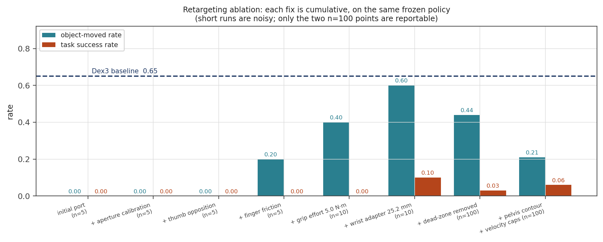
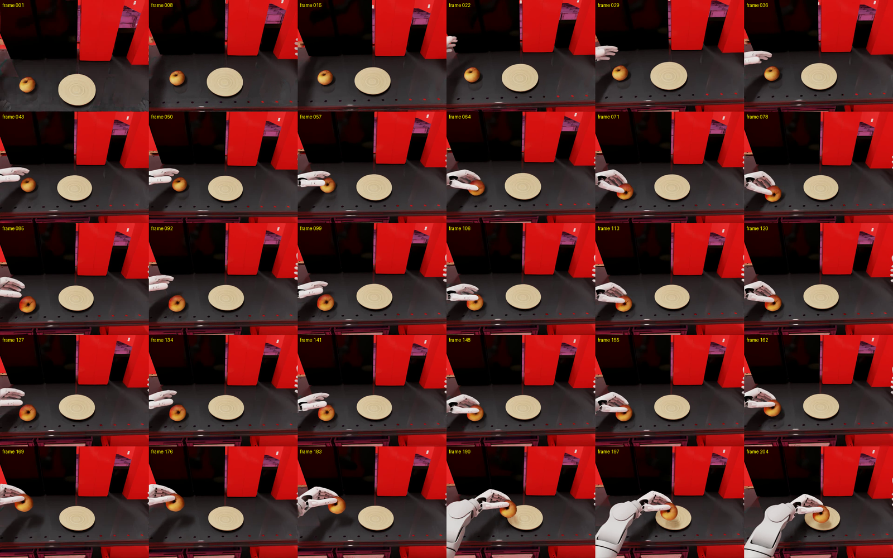

# 3. G1 + BrainCo Revo2 inference on Arena

Run the frozen GR00T N1.7 policy on the retargeted robot, on the same Arena task step 1 ran. Every
argument is identical to the baseline except `--embodiment g1_wbc_agile_joint_brainco`, which is
what makes the difference in the numbers attributable.

## Results

| | Dex3-1 baseline | Revo2, retargeting only |
|---|---|---|
| Task success rate | **0.65** (13/20) | **0.06** (6/100) |
| Frame-verified pick-and-place | not audited | **0.06** — all 6 counted successes are genuine |
| Object moved rate | 0.65 | 0.21 |
| Episodes | 20 | 100 |

A drop is the expected outcome. This step exists to expose the morphology, action-space and
contact-model mismatch before any fine-tuning; what matters is that each contributing cause was
isolated and measured.

## What each gripper fix was worth

Cumulative, each row on top of the one above, same frozen policy and task.

| Configuration | Object moved | Task success | Episodes |
|---|---|---|---|
| Initial port, closure-fraction map only | 0.00 | 0.00 | 5 |
| \+ aperture calibration | 0.00 | 0.00 | 5 |
| \+ thumb opposition schedule | 0.00 | 0.00 | 5 |
| \+ finger friction binding | 0.20 | 0.00 | 5 |
| \+ grip effort 5.0 N·m | 0.40 | 0.00 | 10 |
| \+ wrist adapter, 25.2 mm | 0.60 | 0.10 | 10 |
| \+ dead zone removed | 0.44 | 0.03 | **100** |
| \+ pelvis contour, velocity caps | **0.21** | **0.06** | **100** |



**Only the last two rows are reportable.** The rest are 5 and 10 episodes, which at these rates says
almost nothing: the apparent 0.60 / 0.10 peak is 6 and 1 episodes. They are recorded because they
are what the decisions were made on at the time, not because the rates can be trusted.

Object-moved is the more informative column. It separates "the hand never reaches the apple" from
"it reaches but cannot hold it", and the first three configurations touch the apple in zero episodes
— the hand closes on empty air, so nothing downstream can matter yet. Note that object-moved *falls*
in the last row while success rises: most of that 0.44 was the hand sweeping the apple sideways, and
the pelvis fix removed the sweeps.

Full account, including the rejected hypotheses, in [assignment1_report.pdf](../assignment1_report.pdf).

## What is used

| File | Purpose |
|---|---|
| `env.sh` | Paths, policy arguments and the two embodiment names. Every script sources this. |
| `arena_run.sh` | Runs a command inside the Arena container |
| `run_eval.sh` | The evaluation, printing success rate |
| `record_successes.sh` | Records one labelled clip per success |
| `compare_physics.sh` | Dumps and diffs the as-loaded physics of both robots |
| `media/` | The verified successes, the false success, and the drift plot |

Requires step 1 installed and its policy server running, and step 2's asset and embodiment
installed. Nothing here installs anything.

## Run

```bash
(cd ../1_baseline && ./run_policy_server.sh)   # terminal 1, leave running
./run_eval.sh 100                              # terminal 2
```

Rates from runs shorter than 100 episodes are not meaningful here. One configuration scored 1/10 and
then 0/20 on repeat, which is why the ablation above marks short runs as indicative.

## Verify successes by eye, not by the metric

The task's success term is "apple within the plate region", which also counts the apple being
*pushed* there. In one 100-episode run only 1 of 3 counted successes was a real grasp. Every number
above was checked frame by frame at 4 fps.

```bash
./record_successes.sh 100
```



| File | What it shows |
|---|---|
| `success_ep003.mp4`, `success_ep013.mp4`, `success_ep057.mp4`, `success_ep077.mp4`, `success_ep079.mp4` | Verified grasp, lift, carry and place. Grasped first time. |
| `success_ep053.mp4` | Same, but needed three closing attempts before committing |
| `success_ep057_frames.png` | `ep057` at 4 fps. The density matters: the shadow detaching from the table is what distinguishes a lift from a push. |
| `failure_push_not_lift.mp4` | The counter-example — an episode the metric counts as success in which the apple never leaves the table |
| `failure_push_frames.png` | Its closing frames, where the apple is clearly still touching the table |

Those six are every success in the 100-episode run on the final configuration, which is why the
frame-verified rate equals the metric's 0.06 rather than falling below it.

## Compare the physics between the two robots

```bash
./compare_physics.sh 8
```

Everything authored matched — per-DoF stiffness, damping, armature, friction, effort limit, joint
limits, every link mass — and the pelvis still settled differently from the very first step. Two
real discrepancies came out of the comparison: PhysX joint velocity caps the converter never
authored, and a missing pelvis collision body. Only the second was the cause.


The scene has an invisible collision slab under the table and the robot spawns overlapping it. The
stock G1 has a `pelvis_contour_link` collider, so it braces against that slab, which is why the
baseline's 65% is so repeatable. The supplied BrainCo URDF omits the link, so its pelvis had no
collider at all and what looked like drift was simply the free-standing controller. End-of-episode
pelvis x drift went from a centred +0.5 cm mean on the baseline to −5.7 cm every episode, and back
to +0.1 to +0.3 cm once the collider was restored. A pelvis 5.7 cm further back and 2.4 cm lower
than the policy trained on turns a top-down grasp approach into a side sweep.
