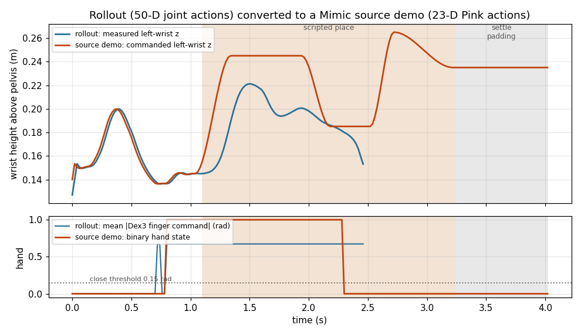

# 4. Demonstration data with Isaac Lab Mimic

A frozen retargeted policy tops out at 0.06 (step 3). Closing the rest of the gap needs
demonstrations on the target embodiment, and this step produces them without a VR rig: harvest the
episodes the retargeted policy already gets right, then multiply them with Isaac Lab Mimic.



One rollout and the Mimic source demo built from it. The commanded wrist height tracks the measured
one exactly until the grasp, after which a scripted place replaces the policy's own release. In the
lower panel the brief finger-command spike at 0.71 s is debounced away, so the hand state fires at
0.78 s where the grasp actually commits.

## Status

| | |
|---|---|
| Rollout harvest | **36 successes / 553 episodes (6.5%)**, three runs |
| Merged rollout set | 22 demos, 3 895 steps, 77.9 s at 50 Hz, 50-D actions, head camera |
| Converted source demos | 14 clean single-grasp demos kept of the 22, 23-D Pink actions, `--scripted_place --z_offset 0.025 --pad_steps 60` |
| Annotation | **9 / 14 sources replay to success** in the Revo2 Pink embodiment (the 5 losses are missed grasps) |
| Generation | **200 / 200 demos**, 6 workers on 3 GPUs, 62 min, **61% generation success** (326 trials) |
| Converted dataset | **200 episodes, 51 746 frames, 50 Hz**, 129 MB LeRobot v2, GR00T loader validation passes |

The harvest rate is worth noting on its own: 6.5% over 553 independent episodes is an independent
confirmation of the 0.06 success rate measured in step 3, from a different script on different runs.

No dataset files are committed. `.gitignore` covers the artifacts, and `push_to_hub.sh` is the only
thing that moves data anywhere. The raw generation output is published at
[pashuparthis/mimic_apple_pick_and_place](https://huggingface.co/datasets/pashuparthis/mimic_apple_pick_and_place):
the six per-worker shards `gen_w0.hdf5` … `gen_w5.hdf5` (34, 34, 33, 33, 33, 33 demos, seeds
1000–1005, 13.4 GB), untouched since `generate_dataset.py` wrote them, with the head-camera frames
inside. `run_merge.sh` turns them into the single 200-demo HDF5 and `run_convert.sh` into the
LeRobot v2 tree, so both derived forms are reproducible from the upload:

```bash
hf download pashuparthis/mimic_apple_pick_and_place --repo-type dataset --local-dir "$DATA_DIR"
TRIM_STEPS=1 ./run_merge.sh && ./run_convert.sh   # TRIM_STEPS=1: these shards predate the step-0 fix
```

## Why this shape

Mimic does not retarget hands. It regenerates *end-effector pose* trajectories by IK and copies the
gripper channel from the source demo verbatim, so it gives spatial augmentation, not embodiment
transfer. That is exactly the right tool here: step 2 already solved the hand correspondence, and
what is missing is *variety* — the harvested episodes all place the apple at one spawn pose.

Three things blocked running it, each real and each verified in the Arena source:

1. **The task refuses the embodiment.** `PickAndPlaceTask.get_mimic_env_cfg` handles only
   `SINGLE_ARM`, `LEFT` and `RIGHT`, and raises otherwise; the G1's default is `DUAL_ARM`. The
   locomanip task has a bespoke G1 config with `left`/`right`/`body` end-effectors, the static task
   has no equivalent. `task.py` and `mdp.py` here supply one, plus a `grasp_<arm>` signal that fires
   when the apple is lifted 3 cm while within 18 cm of the wrist, which is what `--auto` needs.
2. **The Mimic API assumes the 23-D Pink action.** `G1MimicEnv` slices `action[:, 2:5]`, `[5:9]` and
   so on, and reads `obs_buf["policy"]["left_eef_pos"]`, a term that exists only on the Pink
   observation config. On the 50-D joint vector the deployment embodiment uses, these are nonsense.
   `brainco_pink.py` resolves this with a Pink-IK embodiment wearing the Revo2 hands: Pink IK drives
   the arms, the binary hand state is expanded through the *same* `hand_retarget.retarget_batch`
   used at deployment, and `processed_actions` are recorded back in 43-DoF Dex3 space so the
   existing HDF5-to-LeRobot converter and GR00T modality config work unchanged.
3. **Source demos have to be 23-D too.** The harvested rollouts are 50-D joint actions.
   `convert_joint_demos_to_pink_source.py` rebuilds them: wrist poses come from the recorded
   pelvis-frame transforms one step ahead, and the binary hand state is recovered by thresholding
   the commanded Dex3 finger targets at 0.15 rad with a 3-step debounce.

Three more things came out of making it run:

- **Wrist targets have to be anchored to a fixed frame.** Under Pink IK the AGILE WBC lets the
  pelvis settle and drift about 6 cm backwards during a replay, which it did not do under the joint
  policy that recorded the sources, so targets expressed in the *live* pelvis frame reach short of
  the apple and 0 of 14 sources replayed. `brainco_pink.py` re-expresses every wrist target in the
  source demos' settled pelvis pose (`ANCHOR_T_W`), and the Mimic env reports end-effector *and*
  object poses in that same frame, which also makes Mimic's object-relative transforms exact.
- **The policy's own release does not survive open-loop replay.** It opens the hand while swinging
  the arm back and drops the apple on the plate rim, 5–9 cm off centre. The place segment is
  object-relative and the plate is not randomised, so `--scripted_place` replaces everything after
  the grasp with a clean lift, carry, lower and release. Mimic only needs the grasp from the demo.
- **Episodes end the instant success fires**, with the apple still moving, and the success term
  wants the apple at rest (< 0.1 m/s) on the plate. `--pad_steps 60` holds the final pose with the
  hand open so it can settle; `--z_offset 0.025` cancels the arm's gravity sag under Pink IK.

`annotate_demos.patch` fixes a genuine upstream bug: `EpisodeData.add` stores one tensor per step,
so `subtask_term_signals` arrives as a Python list and `torch.any()` raises on it. Every `--auto`
run dies after the first episode without this.

## Round 2: what inspecting the 200 demos changed

Looking at the first dataset frame by frame turned up three problems, all fixed before the second,
2000-demo round.

- **The first camera frame of every episode is stale.** Step 0's image is the render of the
  *previous* trial's final scene (for the first trial, the pre-reset scene); the low-dimensional state
  at step 0 is correct. Cause: in this Isaac Lab, `sim.render()` no longer drives RTX; the camera
  pumps the renderer itself in `ensure_isaac_rtx_render_update()`, de-duplicated per
  `(sim, physics_step_count)`. A reset does not advance the step count, so the camera read inside
  `reset()` is a no-op pump and returns the old annotator frame, which the recorder copies as step 0.
  `num_rerenders_on_reset` cannot help: it loops `sim.render()`. Two fixes: `G1StaticAppleMimicEnv`
  now re-pumps the renderer and recomputes `camera_obs` after every `reset`/`reset_to`
  (`_refresh_camera_obs`), and `run_merge.sh` drops the first step of every demo (`trim_first_step.py`)
  with `TRIM_STEPS=1` so datasets generated before the fix (the round-1 upload) are clean too.
- **Episodes are fast.** 5.2 s each, wrist averaging 0.6 m/s with 2 m/s spikes: the sources were a
  GR00T rollout (reach in 1.5 s) plus a scripted place squeezed under the task's 6 s
  `episode_length_s`, and Mimic executes one source step per env step, so generated demos move exactly
  as fast as their sources. `prepare_source_from_generated.sh` builds the next round's sources *from
  the generated set* (every generated episode is a successful 23-D demo with its exact
  `initial_state`), farthest-point sampled on apple XY for spread, and time-stretched by `TIME_SCALE`
  (default 2: positions linear, quaternions slerp, hand state nearest, settle padding capped at
  `PAD_STEPS`). Round-2 episodes run 8.7–11.6 s with the measured wrist speed at 0.17 m/s mean,
  0.42 m/s p95 (round 1: 0.23 / 0.78).
- **The apple barely moved.** `APPLE_XY_RANGE_M=0.02` is a ±2 cm box, about 15 px in the head camera;
  episodes look identical. Round 2 uses 0.05 (a 10 × 10 cm box). Orientation stays fixed on purpose:
  Mimic transforms the grasp with the full object pose, so a yawed apple would rotate the approach
  around it.

Three infrastructure faults surfaced on the way and are now handled by the scripts:

- `arena_run.sh` ran the container `--privileged` (as upstream does), which hands every `/dev/nvidia*`
  node to the container and makes `--gpus "device=N"` a no-op. All workers saw all GPUs and Kit put
  every RTX renderer on the first GPU Vulkan enumerated; once that GPU filled up, RTX failed silently
  and the recorded camera frames were **all black** while the low-dimensional data stayed valid.
  Without `--privileged` the runtime exposes only the requested GPU, which pins the renderer too.
  `view_demos.py` exists to catch this class of fault: look at the frames, not just the shapes.

- Arena's asset library queries the Lightwheel API at import with the SDK's 10 s timeout, which that
  service regularly exceeds. `g1_apple_mimic/run_patched.py` wraps any Arena script, raising the
  timeout and retrying with back-off (`LW_TIMEOUT_S`, `LW_RETRIES`); `run_annotate.sh` and
  `run_generate.sh` go through it, and workers that die before writing a shard are retried
  (`WORKER_RETRIES`, default 4).
- Isaac Lab mirrors remote USDs and the WBC ONNX under `/tmp`, which is bind-mounted into the
  container. A mirror written by a container that ran as root is unreadable afterwards, and Isaac Lab
  fails *silently*: the apple and robot spawn as empty prims (`No contact sensors added to the prim`)
  and the ONNX copy fails with a misleading "Is the Nucleus Server running?". `arena_run.sh` refuses to
  start in that state and prints the one-line `chown` fix.

## Files

| file | what it does |
|---|---|
| `env.sh` | Paths, pinned versions, task and embodiment arguments |
| `setup.sh` | Checks prerequisites and applies `annotate_demos.patch` |
| `arena_run.sh` | Runs a command in the Arena container, pinned to one GPU |
| `annotate_demos.patch` | One-hunk fix to Arena's annotate script, applied by `setup.sh` |
| `run_harvest.sh` | Records successful episodes from the retargeted policy. The substitute for teleoperation |
| `prepare_source.sh` | Rollouts (50-D) to Mimic source demos (23-D). Host only, no simulator |
| `prepare_source_from_generated.sh` | Generated demos to the next round's source demos, spread-sampled and time-stretched (`NUM_SOURCES`, `TIME_SCALE`). Host only |
| `run_validate.sh` | Shape, success and arm checks before spending simulator time |
| `run_annotate.sh` | `--auto` annotation, writes the `grasp_<arm>` subtask boundary |
| `run_generate.sh` | Launches generation workers across GPUs, with start-up retries |
| `run_merge.sh` | Combines the per-worker shards and drops the stale first step of each demo (`trim_first_step.py`, `TRIM_STEPS`) |
| `run_convert.sh` | Merged HDF5 to GR00T-LeRobot, plus stats and loader validation |
| `push_to_hub.sh` | Uploads the generation shards (`gen_w*.hdf5`) to Hugging Face |
| `status.sh`, `stop.sh` | Watch and stop a running generation |
| `dataset_stats.py` | Reports what is in an HDF5 or LeRobot dataset |
| `view_demos.py` | Head-camera MP4 grid + contact sheet of generated demos; safe to run on live shards (copies first) |
| `make_figure.py` | Regenerates the figure above |
| `trim_first_step.py` | Parallel shard trim + merge used by `run_merge.sh` |
| `g1_apple_mimic/` | The plug-in: Mimic env (with the post-reset camera refresh), subtask graph, grasp signal, Pink-Revo2 embodiment, the rollout recorder, converters, validators, `make_source_from_generated.py`, `run_patched.py` |

Nothing in `IsaacLab-Arena` is modified except the one-hunk annotate patch. `arena_run.sh` mounts
`g1_apple_mimic/` onto the container's working directory, so edits apply on the next run.

## Run

Needs step 1 installed, step 2's embodiment installed, and `1_baseline/run_policy_server.sh`
running for the harvest.

```bash
./setup.sh
./run_harvest.sh 40 800             # ~6 demos per 100 episodes at the measured 0.06
./prepare_source.sh                 # -> source_demos.hdf5, prints which arm picks
./run_validate.sh
export MIMIC_ARM=left               # if the validator says right, set right
./run_annotate.sh                   # ~1 min per demo, --device cpu
./run_generate.sh 200 2 "0"         # 200 demos, 2 workers on GPU 0
./status.sh                         # per-worker rates, demos on disk
HF_TOKEN=hf_... ./push_to_hub.sh <user>/<name>   # gen_w*.hdf5 shards -> Hugging Face
./run_merge.sh
./run_convert.sh                    # -> LeRobot v2 + meta/stats.json
```

Harvesting is the substitute for teleoperation, and it needs no changes to Arena: the recorder
already stamps the success termination term on each episode and `EXPORT_SUCCEEDED_ONLY` discards the
rest, so a rollout loop that leaves terminations enabled produces success-filtered demos for free.
`--dex3_actions` additionally records the executed targets re-expressed in 43-DoF Dex3 space, since
the Revo2 articulation has 41 joints and the raw `(T, 41)` array would fail the converter's shape
assertion.

Annotation and generation both ran on `cuda` once the wrist targets were anchored (above); before
that, `--device cpu` was the only setting on which any replay reproduced the grasp.

Generation cannot use `--num_envs N`: `G1DecoupledWBCPinkAction` asserts `num_envs == 1`. Throughput
comes from independent worker processes, each its own Isaac Sim, seed and output shard, at roughly
8–12 GB of VRAM each.

`APPLE_XY_RANGE_M` defaults to 0.05 m (round 1 used 0.02, see above). The stock environment spawns
the apple at a fixed pose, and Mimic over a fixed scene would only add action noise rather than the
spatial variety that is the entire reason for this step.

A second round from an existing generated set, without harvesting:

```bash
NUM_SOURCES=24 TIME_SCALE=2.0 ./prepare_source_from_generated.sh   # generated -> source_demos.hdf5
./run_annotate.sh
BASE_SEED=2000 ./run_generate.sh 2000 4 "0 1 2"   # asks for 12 workers; the RAM guard stops at 10 on 250 GB
./run_merge.sh && ./run_convert.sh
```

## What this is for

The output plugs into GR00T N1.7 post-training as the target-embodiment demonstrations that step 3's
failure analysis asks for: grasp slip on the Revo2 finger kinematics and the hand's slower closing
are timing and contact problems a frozen policy cannot fix. Fine-tuning on this data and re-running
`3_g1_brainco_inference/run_eval.sh` against the same 100 episodes is the comparison that closes the
loop. The dataset exists ([pashuparthis/mimic_apple_pick_and_place](https://huggingface.co/datasets/pashuparthis/mimic_apple_pick_and_place));
the fine-tuning run and the post-fine-tuning number are not done yet.
