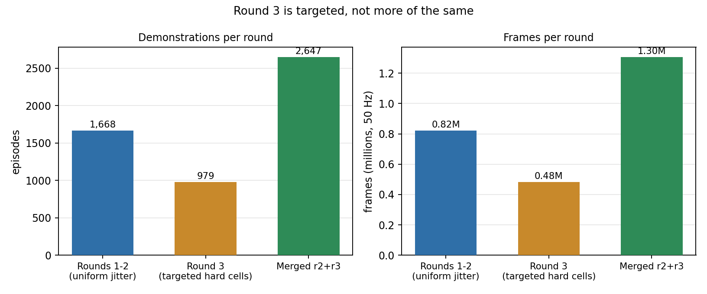
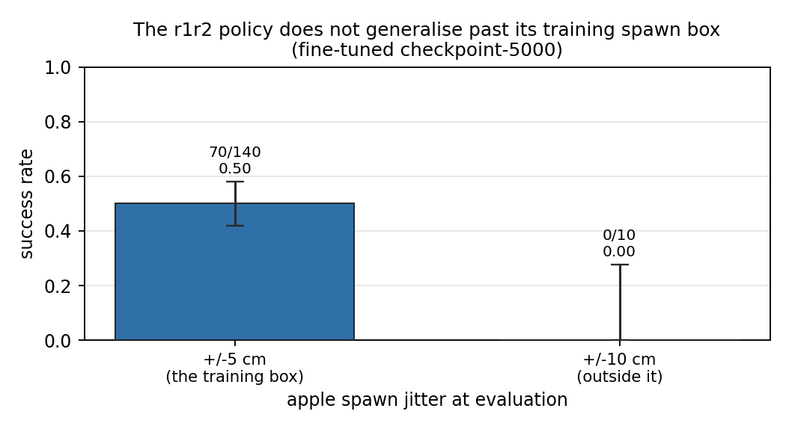
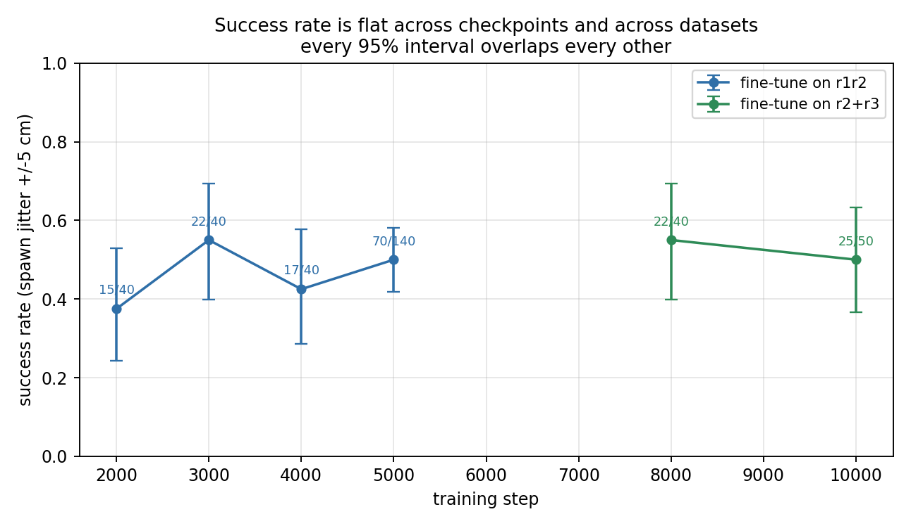
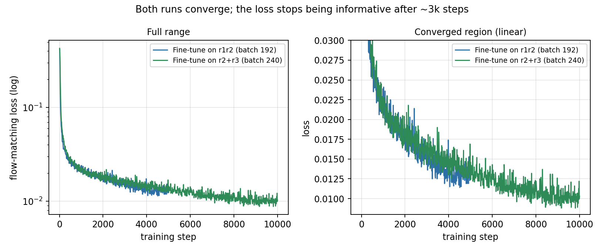
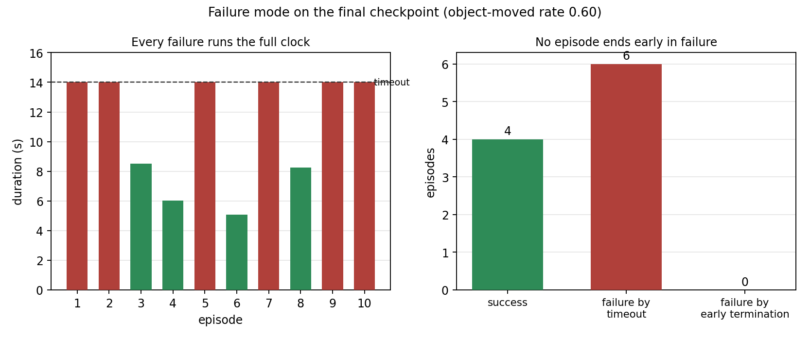
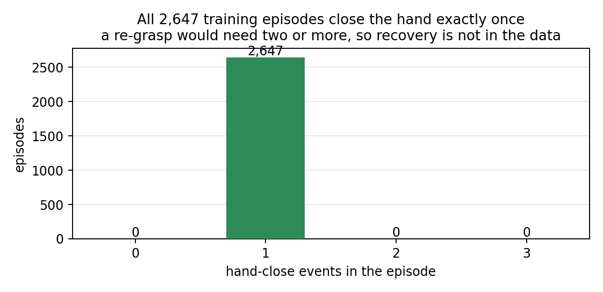

# Step 5 — Fine-tuning GR00T N1.7 onto the Revo2 hands

Step 3 ended with a number: the frozen policy scores **0.06** on the BrainCo Revo2 hands against
**0.65** on the Dex3-1 hands it was trained on (fixed spawn), after the retargeting layer had matched
the two hands about as well as a closed-form map can. Step 4 turned the 6% that already worked into
demonstrations. This step trains on them and measures what came back.

### Headline (matched ±5 cm protocol)

When Dex3-1 and the fine-tuned Revo2 are scored the **same** way — ±5 cm random spawn, 14 s
timeout — the transfer moves the task:

> **0.30 → 0.50** (Dex3-1 frozen 6/20 → Revo2 fine-tuned 70/140)

Retargeting alone is still only **0.06** (6/100, fixed spawn). The jump to 0.50 is retargeting
*plus* 1,668 self-harvested Mimic demos fine-tuned onto Revo2 — an eight-fold gain over
retarget-only (p = 5 × 10⁻¹³ against 6/100). Against the matched Dex3 ±5 cm baseline the lift is
+20 points (p = 0.094; Dex3 Wilson 95% CI [0.15, 0.52], so the Dex3 side is still noisy at n = 20).


That 0.50 is measured with **±5 cm of random spawn jitter**. The fixed-spawn Dex3 0.65 and
retarget-only 0.06 remain as-shipped references; the matched-protocol Dex3 number is
`frozen_dex3_j05` in `results/results.json` (6/20).

**What is deliberately not reported as a headline is the fine-tuned score at the fixed spawn.** It
is 19/20, and it is meaningless: the fixed pose is the one all 1,668 training demonstrations were
generated around, so asking the policy for it again tests it on its own training point and measures
memorisation of one apple position rather than the skill the fine-tune was meant to buy. The number
is kept in `results/results.json` flagged `reportable: false`, and every figure and claim in this
README excludes it.

Everything after the headline is about the limits of the 0.50, because the same policy scores 0.00
at ±10 cm. That is the real subject of this step.

---

## Why there are three datasets

Each round exists because the previous one's *measurement* demanded it. None was planned up front.



### Round 1–2 (`r1r2`, 1,668 episodes) — does behavioural cloning close the gap at all?

Step 3 established that the residual gap was behavioural, not geometric: a five-finger cage around
an opposed thumb holds an apple differently from a three-finger pinch, and the Revo2 takes 0.65 s
to close against the Dex3's 0.2 s. Neither is fixable by a better analytic map, and both are the
kind of thing demonstrations teach directly.

So 22 harvested successes were multiplied by Isaac Lab Mimic into 1,668 episodes with the apple
spawn jittered uniformly, and GR00T N1.7 was fine-tuned on them from NVIDIA's task-tuned
checkpoint for 5,000 steps at global batch 192.

**What it bought: 0.06 → 0.50 under randomised spawns**, and **0.30 → 0.50 against Dex3 under the
same ±5 cm protocol**. The behavioural hypothesis was correct, and it was worth confirming before
spending anything on more data.

Two things are worth being precise about in that number:

- **Against the matched Dex3 ±5 cm baseline it is ahead** (0.50 vs 0.30, p = 0.094). Against the
  older fixed-spawn Dex3 0.65 it is not separable (p = 0.21), but that comparison is asymmetric:
  the fine-tune is asked for a new apple position and the fixed Dex3 baseline is not. That is not a
  claim that the Revo2 is the better hand: this policy is specialised to one embodiment, one object
  and one scene while the baseline checkpoint is a general apple-to-plate policy.
- **n = 140 on the Revo2 side; n = 20 on the matched Dex3 side.** The Revo2 95% Wilson interval is
  [0.42, 0.58]; the Dex3 ±5 cm interval is [0.15, 0.52]. 0.50 is the centre of a real interval, not
  a point fact, and the Dex3 matched baseline still wants more rollouts.

### Round 3 (`r3`, 979 episodes) — because the specialist could not generalise

The r1r2 checkpoint was then evaluated off its nominal spawn, and it fell over:



0.50 at ±5 cm, **0.00 at ±10 cm**. The policy had learned the task
but not the workspace — which is the expected failure of cloning 1,668 replays of 22 trajectories,
since Mimic's jitter widens the *scene* but every demo still descends along one of 22 approach
paths.

#### Finding out which regions had data and which did not

To locate the failure rather than guess at it, I recovered each evaluation episode's apple spawn
position from the recorded video through a pixel-to-world homography and plotted it against the
outcome. The raw arrays are checked in as `results/spawn_eval.csv` (99 evaluation episodes: offset
and outcome) and `results/spawn_demos.csv` (the spawn offset of all 1,668 training demos), so every
per-cell number below is re-derived by `analyze.py` rather than asserted.


The failures are positional, not scattered. Inside the generation box success runs 25/32 = **0.78**
in the half nearer the plate against 13/32 = **0.41** in the far half (p = 0.0023), decaying
monotonically with distance from the plate. Outside the box, where no demonstration was ever
generated, it is close to hopeless — the ±10 cm collapse, seen episode by episode.

I then binned those 99 episodes onto a 3×3 grid of the box, binned the 1,668 demonstrations onto the
same grid, and — because every rollout is a real-time simulation — also replayed the checkpoint
offline against 400 held-out episodes at their exact recorded spawns, hoping its own action error
would reproduce the success map cheaply.


It does not. Success varies **six-fold** across the box (1.00 near the plate at moderate reach down
to 0.17 at the far edge), while the offline action error is flat: a 1.4× spread, correlation −0.06
with distance from centre and +0.03 with distance from the plate, and a cell-wise correlation with
actual success of −0.24 over eight cells, which at that n is noise. **The quantity the model is
trained to minimise is blind to where it fails**, so it cannot be used for targeting; the same
disagreement shows along the training axis, where offline MSE falls monotonically 2.14 → 1.49 ×10⁻³
between steps 2000 and 5000 while sim success bounces 0.37–0.58 with no trend. Everything in this
stage is therefore scored by rollout.

Round 3 was generated against the success map — 979 demonstrations allocated in
proportion to per-cell failure, using a Beta(1,1) posterior mean rather than the raw rate so a cell
that happened to go 0/3 could not swallow the budget, and zero budget for cells already above 0.70.

**What it bought: nothing measurable, and that is the finding.** Merged into `r2r3` (2,647
episodes) and trained for 10,000 steps at batch 240, the result at ±5 cm was 22/40 = **0.55** at
step 8000 and 25/50 = **0.50** at step 10000, against the 70/140 = **0.50** that r1r2 alone had
already reached — a two-proportion p of **1.0**.



Success rate is flat across every checkpoint of both runs, and every 95% interval overlaps every
other one.

The third panel of the spawn-maps figure says why, and it is what I should have read off it
*before* generating a second dataset. **Coverage was already uniform.** Every cell held 165–199
demonstrations (a 1.2× spread) while success over those same cells ranged 0.17 to 1.00 — a six-fold
variation on essentially equal data. The weak cells were never short of
demonstrations; they were equally represented and still failed. Round 3 treated a kinematic problem
as a data-density problem, so adding ~185 more demos to cells that already had ~185 changed nothing.
What varies across that box is how far the arm must reach and how the wrist must be oriented to get
a five-finger cage around the apple, and more replays of the same 22 approach trajectories add
scene diversity, not approach diversity.

Two caveats I cannot discharge with the data I have:

- The r2r3 checkpoint was **never evaluated at ±10 cm**, where round 3's demos actually lie. The
  comparison above is at ±5 cm, where both datasets have coverage — so it is a fair test of "did
  round 3 help in the region we can measure", not of "did round 3 extend the workspace".
- 1.8 epochs over 2,647 episodes is not a large amount of training for a spatial skill.

### Why the loss curve cannot answer this



Both runs converge smoothly and the second reaches a *lower* flow-matching loss (0.0103 vs 0.0139)
while being no better at the task. After roughly 3,000 steps the loss stops predicting success at
all. That is expected for behavioural cloning — the loss measures agreement with the demonstrations,
and the demonstrations are all successes, so it cannot see the thing that actually fails.

This is why the checkpoint sweep exists at all, and why evaluation is the only signal used here to
make decisions.

---

## The failure mode, and why no inference-time fix helped

Every remaining failure looks the same. The policy reaches the apple, closes the hand, the apple
rolls out during the lift — and then the policy carries on to the plate and mimes a place with an
empty hand, running out the 14 s clock.



All six failures in the final checkpoint's evaluation ran the full 700 frames; not one terminated
early. Successes finish in 5.1–8.5 s. The policy never tries again.

That pattern suggested the fault might be at inference rather than in the weights. The policy
predicts 40 actions — 0.8 s at 50 Hz — and stock configuration executes **all 40** before looking
at the world again, so a grasp that fails at frame 5 is not observed until frame 40. Three
alternatives were implemented and evaluated:

| Variant | Replan interval | Result |
|---|---|---|
| Stock (execute all 40) | 0.8 s | 22/40 = 0.55 |
| Shortened chunk, hard swap | 0.2 s | 16/40 = 0.40 (p = 0.26) |
| Temporal ensembling (ACT-style blend) | 0.2 s | 25/40 = 0.62 (p = 0.50) |
| Real-time chunking (RTC, inpainting) | 0.1 / 0.2 / 0.4 s | 10/16, 6/13, 9/15 |


**None produced a single retry**, and none moved the success rate outside noise. In hindsight two
of the three could not have worked, and it is worth recording why: temporal ensembling *averages*
overlapping plans, and the mean of "lift" and "re-grasp" is neither; RTC explicitly guides each new
chunk to continue the previous one, so it is designed to suppress exactly the abrupt plan change a
retry consists of. Both make motion smoother. Smoothness was never the problem.

### The measurement that settled it

Rather than keep testing inference-side theories, the question became whether retry behaviour was
in the training data at all. `audit_regrasp.py` counts hand-close events per episode — a retry must
appear as at least two:

```
$ python3 audit_regrasp.py $DATA_DIR/g1_apple_mimic_r2r3/lerobot
scanned 2647 episodes
  1 close(s):   2647 episodes
episodes containing a re-grasp (>= 2 closes): 0
```



**Every one of 2,647 episodes closes the hand exactly once.** Zero re-grasps. This is structural,
not accidental: the demonstrations are success-filtered Mimic replays of successful trajectories,
so an episode containing a fumble-and-recover could not have entered the dataset. The behaviour was
never in the data, the fine-tune overwrote the vision tower and the whole flow-matching head across
~1.9 M gradient samples, and no inference-time trick can restore a behaviour that is not in the
weights.

A note on what I can and cannot claim about the base checkpoint: NVIDIA's model card for
`GN1x-Tuned-Arena-G1-Static-PickNPlace` says it was post-trained on 200 demonstrations collected by
human teleoperation with an XR headset. Human teleoperation often *does* contain fumbles, so I
cannot assert the base model never had a recovery prior. What is measured is narrower and enough:
our data contains none, and our fine-tune trained the action head hard on our data.

**Getting retry behaviour requires data that contains it** — failed grasps followed by recovery,
which means either not filtering on success, or scripting a recovery into the Mimic source demos.
That is the next experiment, and it is a data-collection change, not an inference change.

---

## Reproducing this

Path-independent: every location derives from `WORK_DIR` (default `~/g1_baseline`, the same as
steps 1–4). Override any of `WORK_DIR`, `DATA_DIR`, `CKPT_ROOT`, `EVAL_DIR`, `LOG_DIR`
independently — the recorded runs kept datasets and checkpoints on a separate RAID array, which is
why nothing here assumes they sit under `WORK_DIR`.

### The analysis, with no GPU

Every figure and every number above regenerates from `results/` alone:

```bash
python3 analyze.py              # 9 figures into figures/ + the printed summary
python3 analyze.py --stats      # numbers only
```

`results/results.json` holds the measurements with the protocol recorded next to each one;
`results/loss_*.json` are the two runs' loss histories, exported from the checkpoints'
`trainer_state.json`.

### The data

The three datasets are published as one repo with three configs:

```bash
hf download pashuparthis/mimic_apple_pick_and_place --repo-type dataset \
  --include 'r2r3/*' --local-dir "$DATA_DIR/g1_apple_mimic_r2r3"
```

`r2r3` is exactly `r1r2 + r3`, so fetch one unless you want the ablation. Or rebuild them from
scratch with `4_mimic_datagen/` (`run_generate.sh`, `run_generate_targeted.sh`, `run_merge.sh`,
`run_convert.sh`).

### Training

```bash
VARIANT=r1r2 ./run_train.sh       # 1,668 demos,  5k steps, batch 192
VARIANT=r2r3 ./run_train.sh       # 2,647 demos, 10k steps, batch 240   (the final checkpoint)
SMOKE=1 ./run_train.sh            # 1 GPU, 3 steps: checks the chain, not the result
./status.sh                       # step, loss, rate, ETA, saved checkpoints
```

Roughly 14 h for 10k steps on three RTX 5090s. Resumable — re-run the same `VARIANT` and it picks
up the last checkpoint, which is how the 10k-step run was finished across three sessions.

A third variant is staged but has **not been run**:

```bash
VARIANT=r2r3-base ./run_train.sh  # same data, from nvidia/GR00T-N1.7-3B instead of the expert
```

This is the experiment that separates what the policy learned from our demonstrations from what it
inherited from NVIDIA's apple-to-plate checkpoint. Every number in this step starts from that
expert, so none of them isolates our contribution — it is the largest open question here.

### Evaluation

```bash
./run_policy_server.sh 10000                    # serve $OUT_DIR/checkpoint-10000, leave running
./run_eval.sh 20                                # 20 episodes at the fixed spawn (see note above)
EVAL_XY_RANGE_M=0.05 ./run_eval.sh 40           # with the +/-5 cm jitter
```

**Spawn jitter is not comparable across values.** `EVAL_XY_RANGE_M=0.0` is the stock deterministic
spawn that steps 1 and 3 measured, and is the only setting comparable to their 0.65 and 0.06. The
checkpoint sweep uses 0.05. Mixing them silently is the easiest way to draw a wrong conclusion from
this step, which is why the default is 0.0 and the value is recorded with every row in
`results.json`.

Also: the environment's success term fires when the apple is *pushed* into the plate region, so it
is an upper bound on true pick-and-place. Audit the videos before quoting a rate.

---

## Files

| File | What it does |
|---|---|
| `env.sh` | All configuration. Three `VARIANT`s, the NCCL settings a PCIe box needs, the evaluation protocol. |
| `run_train.sh` | Fine-tune. Preflights the dataset, venv, modality config and batch divisibility before loading a 3B model. |
| `run_policy_server.sh` | Serve a checkpoint over ZeroMQ. Takes a step number or a directory. |
| `run_eval.sh` | Evaluate against the running server, in the container, with step 3's task and embodiment. |
| `status.sh` | Progress of a running or finished fine-tune, read from `trainer_state.json`. |
| `arena_run.sh` | Container wrapper; same as earlier steps plus a `/ckpt` mount. |
| `analyze.py` | Regenerates all 9 figures and the statistics from `results/`. No GPU. |
| `audit_regrasp.py` | Counts hand-close events per episode. The measurement that explains the failure mode. |
| `results/` | Recorded measurements and loss curves — the evidence base for the report. |
| `figures/` | Generated; safe to delete and regenerate. |

## Every number, in one table

Protocol unless noted: same task / scene, 50 Hz, 14 s timeout. Dex3 rows use
`g1_wbc_agile_joint`; Revo2 rows use `g1_wbc_agile_joint_brainco`. The fixed-spawn Dex3 row used the
original 6 s timeout from step 1.

| Model | Spawn jitter | Result | 95% CI |
|---|---|---|---|
| Frozen policy, Dex3-1 hands | 0 cm | 13/20 = 0.65 | [0.43, 0.82] |
| **Frozen policy, Dex3-1 hands** | **±5 cm** | **6/20 = 0.30** | **[0.15, 0.52]** |
| Frozen policy, Revo2 hands | 0 cm | 6/100 = 0.06 | [0.03, 0.12] |
| Fine-tuned on r1r2, step 5000 | 0 cm | 19/20 = 0.95 — *excluded, training point* | [0.76, 0.99] |
| Fine-tuned on r1r2, step 2000 | ±5 cm | 15/40 = 0.375 | [0.24, 0.53] |
| Fine-tuned on r1r2, step 3000 | ±5 cm | 22/40 = 0.55 | [0.40, 0.69] |
| Fine-tuned on r1r2, step 4000 | ±5 cm | 17/40 = 0.425 | [0.29, 0.58] |
| **Fine-tuned on r1r2, step 5000** | **±5 cm** | **70/140 = 0.50** | **[0.42, 0.58]** |
| Fine-tuned on r2r3, step 8000 | ±5 cm | 22/40 = 0.55 | [0.40, 0.69] |
| Fine-tuned on r2r3, step 10000 | ±5 cm | 25/50 = 0.50 | [0.37, 0.63] |
| Fine-tuned on r1r2, step 5000 | ±10 cm | 0/10 = 0.00 | [0.00, 0.28] |

**Matched-protocol headline:** Dex3 ±5 cm **0.30** → Revo2 fine-tuned ±5 cm **0.50**.

## What I would do next, in order

1. **Run `VARIANT=r2r3-base`.** Without it, nothing here separates our demonstrations' contribution
   from the expert checkpoint's.
2. **Evaluate the r2r3 checkpoint at ±10 cm**, where round 3's demos actually are. This is cheap and
   it is the only test that can tell whether round 3 worked.
3. **Generate demonstrations that contain recovery** — either stop filtering on success, or script a
   failed grasp followed by a re-approach into the Mimic sources. The audit says this is the only
   route to retry behaviour, and it is a data change rather than an inference change.
4. **Diversify the approach, not the scene.** Widen the spawn box during generation and harvest more
   distinct source trajectories, rather than adding episodes inside the existing box. The flat
   checkpoint curve and the uniform-coverage result both say more replays of the same 22 paths will
   not help.
