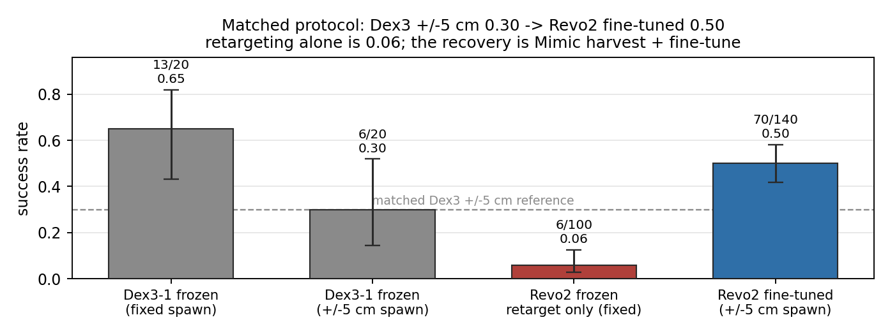
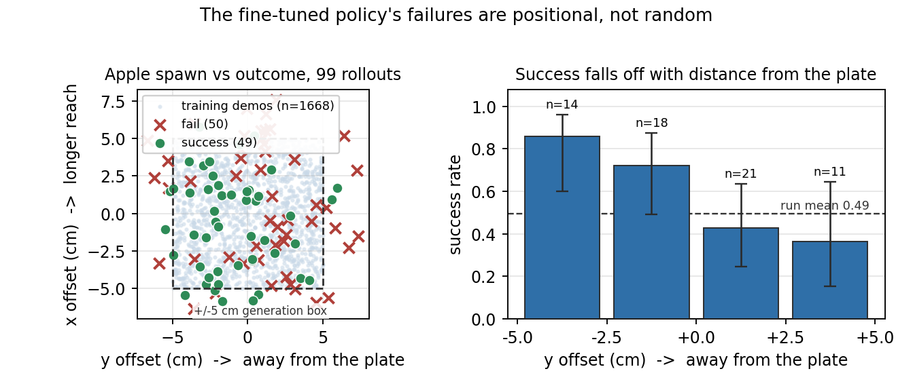
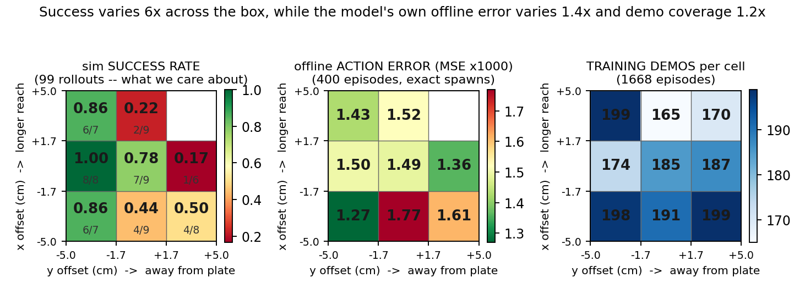

# Transferring a dexterous manipulation policy from Unitree Dex3-1 to BrainCo Revo2 Touch hands

A GR00T N1.7 policy, trained on a Unitree G1 29-DoF with **7-DoF Dex3-1 hands**, made to drive the
same robot with **6-DoF BrainCo Revo2 Touch hands** — first by retargeting alone, then by
fine-tuning on demonstrations the retargeted policy generated for itself.

### Headline result (matched protocol)

Under the **same** evaluation the fine-tuned Revo2 policy is scored on — ±5 cm random apple spawn,
14 s timeout, same task / scene / success term — the frozen Dex3-1 source policy scores
**0.30 (6/20)** and the transferred Revo2 policy scores **0.50 (70/140)**:

> **Dex3-1 ±5 cm → Revo2 after retarget + Mimic harvest + fine-tune: 0.30 → 0.50**

That is the fair comparison. Retargeting alone does *not* get you there (it drops to 0.06 on fixed
spawn); the recovery is from self-harvested Mimic demos fine-tuned onto the retargeted embodiment.
Dex3 n is still small (Wilson 95% CI [0.15, 0.52]; two-proportion p = 0.094 vs 0.50), so treat 0.30
as a centre estimate, not a precise floor.

|  | Dex3-1 (source) | Dex3-1 (source) | Revo2, retarget only | Revo2, fine-tuned |
|---|---|---|---|---|
| Actuated DoF per hand | 7 | 7 | 6 | 6 |
| Fingers | 3 | 3 | 5 | 5 |
| Robot DoF | 43 | 43 | 41 | 41 |
| Apple spawn at evaluation | fixed, as shipped | **±5 cm, random** | fixed, as shipped | **±5 cm, random** |
| Episode timeout | 6 s | 14 s | 6 s | 14 s |
| Task success | **0.65** (13/20) | **0.30** (6/20) | **0.06** (6/100, frame-verified) | **0.50** (70/140) |

The fixed-spawn Dex3 column (0.65) is the as-shipped reference from step 1. The ±5 cm Dex3 column
is the matched-protocol baseline measured later on the same harness as the fine-tune evals
(`rollouts_dex3_baseline_j05_20260911_165851`). The Revo2 retarget-only column is the embodiment
gap after geometry mapping alone. The fine-tuned column is what 1,668 self-harvested Mimic demos
bought back: an eight-fold gain over retarget-only (p = 5 × 10⁻¹³ against 6/100).

The fine-tuned policy's score at the fixed spawn is deliberately not reported as a headline number:
it is the pose all 1,668 of its training demonstrations were generated around, so it measures
memorisation of one apple position rather than a transferred skill (kept in `results.json` as
`reportable: false`).

The interesting part of this repository is where the fine-tuned policy stops working: 0.00 at
±10 cm, and a second 979-episode round aimed at exactly that weakness did not measurably fix it.
[`5_gr00t_finetune/`](5_gr00t_finetune/) is that investigation.

[`g1_brainco_gr00t_inference.mp4`](g1_brainco_gr00t_inference.mp4) is every rollout behind that
0.50: all 140 evaluation episodes of the fine-tuned policy, played at once on a 14×10 grid, head
camera, ±5 cm random spawn. Borders are green for success and red for failure, and a tile dims when
its episode ends — so the successes drop out between 5 and 8.5 s while the failures stay lit to the
14 s timeout, which is the "every failure runs the full clock" result visible directly rather than
as a statistic.

For a single episode at full resolution, the six verified retarget-only successes and the
false-success counter-example are in
[`3_g1_brainco_inference/media/`](3_g1_brainco_inference/media/).

## Repository layout

Five steps, in the order they were done. Each has its own README with commands and expected output.

| Step | Contents |
|---|---|
| [`1_baseline/`](1_baseline/) | Run the existing apple pick-and-place unmodified. Establishes the reference number. |
| [`2_retargeting/`](2_retargeting/) | Build the Revo2 robot asset, and the layer that maps Dex3 commands onto it. |
| [`3_g1_brainco_inference/`](3_g1_brainco_inference/) | Run the policy on the retargeted robot; record successes and instrument the physics comparison. |
| [`4_mimic_datagen/`](4_mimic_datagen/) | Harvest the policy's successes and multiply them with Isaac Lab Mimic into fine-tuning datasets. |
| [`5_gr00t_finetune/`](5_gr00t_finetune/) | Fine-tune GR00T N1.7 on them, across three dataset rounds. Training, evaluation, the figures, and why the second round did not help. |
| [`dataset/`](dataset/) | Pointer to the HF dataset ([pashuparthis/mimic_apple_pick_and_place](https://huggingface.co/datasets/pashuparthis/mimic_apple_pick_and_place)); `./fetch.sh` downloads it (or use the local symlink). |
| [`assignment1_report.pdf`](assignment1_report.pdf) | The write-up: platform choice, the correspondence, asset changes, the fine-tuning results and sim-to-real notes. |
| [`assignment2_report.pdf`](assignment2_report.pdf) | Assignment 2 (2 pages): the process for teaching a new right-to-left handover skill on the same G1 + Revo2 stack. |
| [`g1_brainco_gr00t_inference.mp4`](g1_brainco_gr00t_inference.mp4) | Headline clip: all 140 evaluation rollouts of the fine-tuned policy on the Revo2 hand, synchronised on one grid — the 70/140 = 0.50 in full, successes and failures alike. |

The generated data is not committed (`.gitignore` covers `*.hdf5`, `*.parquet`, `lerobot/`). All
three dataset rounds are published on Hugging Face in GR00T-LeRobot v2.1 form — ready to hand
straight to `launch_finetune.py`, with no conversion step:

**[pashuparthis/mimic_apple_pick_and_place](https://huggingface.co/datasets/pashuparthis/mimic_apple_pick_and_place)**

| Config | Episodes | Frames | Size | What it is |
|---|---|---|---|---|
| `r1r2` | 1,668 | 821,610 | 1.8 GB | Rounds 1–2, apple spawn jittered uniformly. |
| `r3` | 979 | 483,294 | 1.0 GB | Round 3, aimed at the spawn cells the r1r2 policy failed in. |
| `r2r3` | 2,647 | 1,304,904 | 2.7 GB | The union; what the final checkpoint trained on. |

`r2r3` is exactly `r1r2 + r3`, so fetch one unless you want the ablation between them:

```bash
hf download pashuparthis/mimic_apple_pick_and_place --repo-type dataset \
  --include 'r2r3/*' --local-dir ./apple_data
```

Or rebuild from scratch with `4_mimic_datagen/` (`run_generate.sh`, `run_generate_targeted.sh`,
`run_merge.sh`, `run_convert.sh`).

## The trained policy

The final fine-tune — step 10000 of the `r2r3` run, the 0.50 above — is published:

**[pashuparthis/dex3-brainco-retargeted-policy](https://huggingface.co/pashuparthis/dex3-brainco-retargeted-policy)**

```bash
hf download pashuparthis/dex3-brainco-retargeted-policy --local-dir ./policy
```

It holds the inference weights and config only — 6.5 GB, no optimiser state — so it loads straight
into `Gr00tPolicy` with `embodiment_tag="new_embodiment"`. Serve it with
`5_gr00t_finetune/run_policy_server.sh` and evaluate it with `run_eval.sh`.

One thing to know before using it: **the checkpoint still speaks Dex3-1.** It emits the same 50-D
action the base policy did, and `2_retargeting/`'s layer is what turns those finger commands into
the Revo2's 41 DoF underneath it. The weights on their own will not drive a Revo2 hand.

All five steps are complete and their numbers are measured. Nothing in this repository is a plan:
every rate quoted here came out of `isaaclab_arena/evaluation/policy_runner.py` on this machine,
and [`5_gr00t_finetune/results/results.json`](5_gr00t_finetune/results/results.json) holds them all
with the protocol recorded next to each one.

## The write-up

[assignment1_report.pdf](assignment1_report.pdf) is the full account in four pages: why this
platform and task, what the two hands differ by, how the correspondence was derived, what changed
in the asset, the retargeting results with the ablation and the pelvis investigation, the
data-generation pipeline, then the fine-tuning — the three dataset rounds, what each bought, the
generalisation limit, and the failure-mode analysis. Every figure and every number in it comes from
`5_gr00t_finetune/results/`.

[assignment2_report.pdf](assignment2_report.pdf) is the two-page process write-up for Assignment 2:
teaching the same stack a new skill on the Revo2 hands (pick with the right hand, hand over to the
left, put down, with the release triggered by the receiving hand's contact rather than a timer).

## Setup

Requires an NVIDIA GPU with ~32 GB VRAM (an RTX 5090 was used), Docker with the NVIDIA container
runtime, and about 80 GB of disk.

Installation is scripted and lives with step 1, which is self-contained:

```bash
docker login nvcr.io          # username is the literal string $oauthtoken, password is your NGC API key
cd 1_baseline
./setup.sh
```

That pulls the Isaac Sim image, clones and builds IsaacLab-Arena at `release/0.2.1`, clones
Isaac-GR00T at the pinned commit `4b1dca9`, downloads the checkpoint, and wires the policy config to
it. Roughly an hour, almost all of it downloading. Every step is skipped if already done, so
re-running after a failure resumes. Everything lands under `~/g1_baseline`; override with `WORK_DIR`.

See [`1_baseline/README.md`](1_baseline/README.md) for the full prerequisites and what each of the
six install steps does.

## Run everything

```bash
# The inference server runs on the host and is shared by every step that runs a policy.
(cd 1_baseline && ./run_policy_server.sh)      # leave running

# 1. baseline: expect ~0.65 at fixed spawn; matched +/-5 cm reference is 0.30 (6/20)
(cd 1_baseline && ./run_eval.sh 100)

# 2. build the Revo2 asset and install the retargeting layer
(cd 2_retargeting && ./build_asset.sh && ./install.sh && python3 test_retargeting.py)

# 3. run the policy on the retargeted robot: expect success_rate ~0.06
(cd 3_g1_brainco_inference && ./run_eval.sh 100)

# 4. build demonstration data for fine-tuning
(cd 4_mimic_datagen && ./setup.sh && ./prepare_source.sh)

# 5. fine-tune on it, then evaluate: expect success_rate ~0.50 at +/-5 cm spawn jitter
(cd 5_gr00t_finetune && VARIANT=r2r3 ./run_train.sh && ./status.sh)
(cd 5_gr00t_finetune && ./run_policy_server.sh 10000)   # leave running, then:
(cd 5_gr00t_finetune && ./run_eval.sh 20)
```

The analysis and every figure regenerate with no GPU, from recorded results:

```bash
(cd 5_gr00t_finetune && python3 analyze.py)
```

`assignment1_report.pdf` is the written write-up of all of this. It is checked in as a finished
document; the markdown and the small matplotlib typesetter that produce it are kept outside this
repository, so what you clone is the work and not the machinery that formatted it.

Each step folder is self-contained: its own `env.sh`, container runner and media, with no references
outside itself. Installation lives in steps 1 and 2, which share the same `WORK_DIR` defaults, so
whichever you install first makes the other's setup a no-op. Everything lands under `~/g1_baseline`;
override `WORK_DIR` to move it, or `DATA_DIR` / `CKPT_ROOT` / `EVAL_DIR` to put the bulk artefacts
on a different disk. No script in this repository contains an absolute path to one machine.

## What the retargeting layer actually does

Seven independently actuated joints per hand collapse to six, two of which have no source signal at
all, and each Revo2 finger has to represent a two-joint Dex3 flexion chain with a single actuator.
Angle conventions differ too, so the correspondence is defined on **closure fraction** rather than
angle, and calibrated on **fingertip aperture** rather than closure fraction — the Dex3 opens to
193 mm and the Revo2 only to 141 mm, so matching fractions closes the hand on empty air.

Four things then have to be right at once:

- **Aperture calibration.** Match openings, not fractions, on the running minimum so the map stays
  monotone. Without it the hand closes on empty air in every episode.
- **Thumb opposition.** The Revo2's metacarpal sweeps across the palm rather than rolling like the
  Dex3's thumb. A geometric schedule swings it into opposition *ahead* of the fingers. Pinch aperture
  at 75% closure: 36.9 mm → 5.5 mm, without which no grasp is geometrically possible.
- **Invertibility.** Strict aperture matching leaves a dead zone where commanded closure produces no
  motion, so the policy's own command never reappears in its next observation. Visible in logs as
  the policy opening and re-closing mid-grasp.
- **Interface preservation.** The action space stays 50-D in Dex3 coordinates. The 41-DoF
  articulation is reached only inside the action term, so the policy, its client, the modality
  config and the whole-body controller are all untouched.

Full derivation in [assignment1_report.pdf](assignment1_report.pdf) (section "The correspondence").

## The finding that mattered most was not in the hand

Debug traces showed the pelvis creeping 5.7 cm backwards every episode and settling 2.4 cm lower,
where the baseline settles in 0.4 s around a centred +0.5 cm mean. That turns the top-down grasp
approach the policy learned into a side sweep. Every authored property matched between the two
robots: per-DoF gains, armature, friction, limits, every link mass. And the pelvis still settled
differently from the first step.

The scene has an invisible collision slab under the table and the robot spawns overlapping it. The
stock G1 has a `pelvis_contour_link` collider and braces against it, which is why the baseline's 65%
is so repeatable. The supplied BrainCo URDF omits that link, so its pelvis had no collider at all
and what looked like drift was just the free-standing controller. Restoring it took true
pick-and-place from 1/100 to 6/100.

Six other hypotheses were tested and rejected along the way, including two that seemed much more
likely; they are recorded in [assignment1_report.pdf](assignment1_report.pdf) (section "The pelvis").

## What fine-tuning fixed, and what it did not



Because the residual failures were behavioural rather than geometric, the fix had to be
demonstrations — and none of them were teleoperated. The 6% of episodes that already succeeded were
harvested from the retargeted policy itself and multiplied by Mimic. Fine-tuning on 1,668 of them
took the task from **0.06 to 0.50 under randomised spawns**, and from **0.30 → 0.50 against the
Dex3 source under the same ±5 cm protocol**, which confirmed the diagnosis from step 3.

It also produced a specialist. The same checkpoint scores **0.00 at ±10 cm** of spawn jitter: it
learned the task but not the workspace, which is what cloning 1,668 replays of 22
approach paths should be expected to do.

To find out *where* it failed, each evaluation episode's apple spawn position was recovered from the
recorded video and plotted against the outcome:



The failures are positional. Inside the generation box success runs 0.78 in the half nearer the plate
against 0.41 in the far half (p = 0.0023) and decays monotonically with distance from it. Binning
those episodes onto a 3×3 grid, alongside all 1,668 training demonstrations and the model's own
offline action error on 400 held-out episodes:



A third round of 979 episodes was then aimed at the failing cells in proportion to their failure
rate. It brought the ±5 cm rate to 0.55 against 0.50 — a two-proportion p of 1.0, i.e. **no
measurable gain**, with success flat across every checkpoint of both runs.

The third panel is why, and it is the thing to read before generating a second dataset: **coverage
was already uniform.** Every cell held 165–199 demonstrations while success over those same cells
ranged 0.17 to 1.00 — a six-fold variation on essentially equal data. The weak cells were never short
of demonstrations, so round 3 treated a kinematic problem as a data-density problem. What varies
across that box is reach and wrist orientation, and more replays of the same 22 approach trajectories
add scene diversity rather than approach diversity.

The middle panel is a second negative result worth keeping: the offline action error the model is
trained to minimise is spatially flat (1.4× against success's 6×) and correlates with actual success
at −0.24 over eight cells. It cannot be used as a cheap stand-in for rollouts.

The remaining failures share one shape: the hand closes, the apple rolls out during the lift, and
the policy carries on to the plate and mimes a place with an empty hand until the clock runs out. It
never tries again. Two inference-time mechanisms were built to fix that — ACT-style temporal
ensembling and Real-Time Chunking — and neither produced a single retry, because neither could: one
averages overlapping plans and the other is explicitly designed to make each new plan continue the
last. The explanation turned out to be in the data. All **2,647 training episodes close the hand
exactly once**; the demonstrations are success-filtered by construction, so a fumble-and-recover
episode could never have entered the set. Recovery is not a behaviour this policy can be asked for
at inference time — it has to be demonstrated.

Full analysis, all eight figures and the reproduction commands are in
[`5_gr00t_finetune/README.md`](5_gr00t_finetune/README.md).

## Reading the numbers

The task's success term is "apple within the plate region", which also counts the apple being
*pushed* there. In one 100-episode run only 1 of 3 counted successes was a real grasp, so every
number in this repository was checked frame by frame at 4 fps.

Three more caveats worth knowing before quoting anything:

- **Small-n rates are noise.** One configuration scored 1/10 and then 0/20 on repeat. The
  fine-tuning sweep pools repeats to reach n = 40–140 and quotes Wilson intervals; at n = 10 the
  interval is roughly ±0.3, wide enough to hide any effect in this repository.
- **Spawn jitter is not comparable across values.** Steps 1 and 3 measure the stock deterministic
  spawn (`APPLE_SPAWN_XY_RANGE_M = 0.0`), which tests repeatability under physics and policy
  stochasticity. Step 5's checkpoint sweep uses ±5 cm, which tests spatial generalisation as well.
  The matched-protocol headline is therefore **Dex3 ±5 cm (0.30) vs Revo2 fine-tuned ±5 cm
  (0.50)**; the fixed-spawn 0.65 / 0.06 rows are a separate as-shipped reference.
  `results.json` records the jitter beside every rate for that reason.
- **The fine-tuned numbers all start from NVIDIA's task-tuned checkpoint**, so none of them
  isolates what our demonstrations contributed from what the base model already knew. The run that
  would settle it (`VARIANT=r2r3-base`) is staged and has not been run.

## Versions this was built against

These are the exact versions every number in this repository was measured on. Isaac Sim and Arena
in particular move fast enough that a different release will change behaviour.

| Component | Version |
|---|---|
| Isaac Sim | 6.0.0-dev2 |
| IsaacLab-Arena | `release/0.2.1` |
| Isaac-GR00T | `4b1dca9` |
| Starting checkpoint | `nvidia/GN1x-Tuned-Arena-G1-Static-PickNPlace` |
| Unitree G1 / Dex3-1 assets | as shipped with Arena |
| BrainCo Revo2 URDF and meshes | as supplied |

What is actually ours here is the retargeting layer, the asset patches, the data-generation
pipeline and the analysis. Everything else is upstream and unmodified, except for the asset fixes
[assignment1_report.pdf](assignment1_report.pdf) sets out in "The robot underneath the hand".
