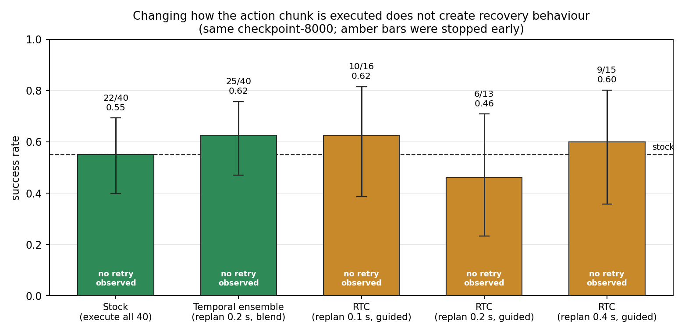

# Transferring a Dex3-1 manipulation policy to BrainCo Revo2 Touch hands

A GR00T N1.7 policy trained on a Unitree G1 wearing 7-DoF Dex3-1 hands, made to drive the same robot
wearing 6-DoF BrainCo Revo2 Touch hands. I did it in two stages: an analytic retargeting layer that
leaves the policy and its action space untouched, then a fine-tune on demonstrations the retargeted
policy generated for itself. There is no teleoperation and no human demonstrator anywhere in the
pipeline. Each step folder has its own README with the commands.

| Configuration | Spawn, timeout | Success | n |
|---|---|---|---|
| Dex3-1, frozen policy, as shipped | fixed, 6 s | 0.65 | 13/20 |
| Dex3-1, frozen policy | ±5 cm, 14 s | 0.30 | 6/20 |
| Revo2, retargeting only | fixed, 6 s | 0.06 | 6/100 |
| **Revo2, retarget + harvest + fine-tune** | **±5 cm, 14 s** | **0.50** | **70/140** |
| Revo2, the same fine-tune, wider spawns | ±10 cm, 14 s | 0.00 | 0/10 |

Rows two and four are the only pair measured under the same protocol: the frozen Dex3-1 source
scores **0.30** where the transferred Revo2 policy scores **0.50** (p = 0.094; the Dex3 n is small,
Wilson 95% CI [0.15, 0.52]). Retargeting alone reaches 0.06 against an as-shipped Dex3 reference of
0.65, and the ablation below shows that no change on the hand side alone produced a single success.
That told me the residual gap was behavioural rather than geometric, which is what made fine-tuning
the right next move: 1,668 self-generated demonstrations take the task from **0.06 to 0.50** under
randomised spawns. Where that policy then stops working turned out to be the more useful half of the
result, so most of this report is about that.

## The two hands, and the map between them

The requirement was a pretrained policy whose hands could be swapped for a target with a different
DoF count. Three candidates failed on inspection, leaving IsaacLab-Arena's
`galileo_g1_static_pick_and_place`: the right robot, 7 DoF per hand against the Revo2's 6, no
locomotion, and a published checkpoint that reproduced at 0.65. Two of its properties matter later.
The task is single-handed in practice, since the right-hand action is identically zero. And **the
apple spawn is deterministic**, so everything the fine-tuned policy knows about *where* the apple is
comes from jitter I added deliberately during data generation.

| | Dex3-1 (source) | Revo2 Touch (target) |
|---|---|---|
| Actuated DoF per hand | 7 | 6 |
| Fingers | 3 | 5 |
| Max fingertip aperture | 193.3 mm | 140.6 mm |
| Time to close | ~0.2 s | ~0.65 s |
| Mass per hand | 1.39 kg | 0.29 kg |
| Whole-robot DoF | 43 | 41 |

The policy runs at 50 Hz on a 480×640 head camera, a 43-D joint state and a 50-D action, feeding an
AGILE whole-body controller. None of that changes between runs, and the policy is never told the
hands changed. Everything in the table was measured by forward kinematics on both URDFs rather than
taken from datasheets. Two further differences do not fit a table: fingertips at equal closure
differ by 2–3 cm, and ring and pinky have no source signal at all while `thumb_0` has no target
counterpart. Angle conventions are irreconcilable too — Dex3 joints are sign-mirrored with negative
limits for "closed", every Revo2 joint runs from zero upwards — so the map is defined on **closure
fraction**. Index, middle and thumb collapse to a single grasp closure, and ring and pinky follow
their mean, which is the one place the map invents information.

Four things then have to be right at once, and I found each of them by watching something fail.

- **Aperture calibration.** Matching fractions leaves a 33 mm gap where the Dex3 pinches to 11.7 mm,
  so the hand closes on empty air. Openings have to be matched on the *running minimum*, because
  both aperture curves turn back up once the fingers curl past the thumb.
- **Thumb opposition.** The Revo2's metacarpal sweeps across the palm instead of rolling, so a
  searched schedule swings it into opposition ahead of the fingers. Pinch aperture at 75% closure
  goes from 36.9 mm to 5.5 mm, and without it no grasp is geometrically possible.
- **Invertibility.** Strict aperture matching wants zero Revo2 closure below a Dex3 closure of about
  0.35, which is a closed-loop hazard: the policy commands a closure, nothing moves, and its next
  observation reports an open hand. Lifting those entries took round-trip error 0.300 → 0.000.
- **Interface preservation.** The action space stays 50-D in Dex3 coordinates and the 41-DoF
  articulation is only ever reached inside the action term, so the policy, its client, the modality
  config and the controller are all untouched. That is what later made fine-tuning a drop-in.

The wrist adapter belongs in the same list. The policy aims the wrist having learned where a Dex3
palm sits relative to it, and at the stock mount the Revo2's grasp centre is 25.2 mm away, so the
hand closes above the apple's equator and rolls it. I applied the offset in the URDF; on hardware it
would be a machined plate.

## The robot underneath the hand

Isaac Lab's URDF converter was unfaithful in four ways. Three raised errors and were quick: a welded
pelvis, instanceable links that stop the task's friction material binding to the fingers, and
missing joint-velocity caps. The fourth raised nothing at all. The converter nests links under a
`Geometry` scope, so the default camera path matches no prim and USD quietly creates an empty Xform
at the robot origin. **The head camera was sitting at the pelvis, staring at the robot's own arms,
and the policy is a vision model.** I fixed it and verified the stream against the baseline.

## What retargeting alone was worth

Every configuration below runs the same frozen policy, task, scene and evaluation script; between
the Dex3 and Revo2 columns the only difference is `--embodiment`. The success term also counts the
apple being *pushed* into the plate region, and in one run only 1 of 3 counted successes was a real
grasp, so I checked every episode frame by frame at 4 fps.

Object-moved is the more informative series, and the first three configurations touch the apple in
zero episodes, so nothing downstream of the hand could have mattered yet. **No change on the gripper
side alone produced a single success.** The two fixes that moved the needle were the wrist adapter
and the pelvis collider — mount geometry and physics, not finger kinematics. Object-moved actually
*falls* in the last row while success rises, because most of that 0.44 was the hand sweeping the
apple sideways, and the pelvis fix removed the sweeps.

The pelvis was the most instructive failure of the project. It crept 5.7 cm backwards every episode
and settled 2.4 cm lower, which turns the top-down grasp the policy learned into a side sweep that
pushes the apple. Every authored property matched between the two robots — per-DoF gains, armature,
friction, limits, every link mass — so I stopped reading configs and compared the runtime values
PhysX had actually loaded.

An invisible collision slab sits under the table and the robot spawns overlapping it. The stock G1
has a `pelvis_contour_link` collider and braces against that slab, which is why the baseline's 0.65
is so repeatable, and the supplied BrainCo URDF omits the link entirely. Its pelvis had no collider
at all, so what looked like drift was the free-standing controller doing its job. Restoring the link
took frame-verified pick-and-place from 1/100 to 6/100, after four other plausible explanations had
been tested and rejected.

What was left was grasp slip. The hand reaches the apple and closes, but the contact patch is a
five-finger cage against an opposed thumb rather than a three-finger pinch, and the apple rolls out
during the lift. A better analytic map can align where fingertips sit; it cannot change that five
fingers cage a sphere where three pinch it, nor make a 0.65 s actuator arrive at a grasp timed for a
0.2 s one. Both are closed-loop behaviour, and behaviour is what demonstrations show directly. That
is the argument for fine-tuning, and it rests on the ablation rather than on a hunch.

## Demonstrations without a teleoperator

Successes are harvested straight from the retargeted policy: Arena's recorder stamps the success
term and discards failures, so a plain rollout loop yields success-filtered demonstrations for free.
That returned **36 successes from 553 episodes (6.5%)**, independently confirming the measured 0.06,
and those became 22 Isaac Lab Mimic source demos. Mimic regenerates each against a randomised scene
with per-episode spawn jitter and grasp-depth resampling. The jitter is essential — the stock
environment spawns the apple at a fixed pose, so without it Mimic would add only action noise.
Getting there meant rebuilding the sources as 23-D Pink IK actions and writing the subtask graph the
static task ships without. One property matters a great deal later: **the harvester filters on
success**, so nothing that failed and then recovered can possibly be in the data.

Both fine-tunes start from NVIDIA's task-tuned `GN1x-Tuned-Arena-G1-Static-PickNPlace`, the same
weights evaluated frozen above, and follow Arena's recipe — adapt the vision tower, the projector
and the flow-matching action head, leave the language model frozen.

## What fine-tuning bought

Fine-tuning on 1,668 episodes for 5,000 steps at batch 192 took the task from **0.06 to 0.50**
(70/140), p = 5×10⁻¹³ against retargeting alone. Against the matched Dex3 ±5 cm baseline that is
**0.30 → 0.50** (6/20 → 70/140, p = 0.094). The fixed-spawn Dex3 0.65 stays as the as-shipped
reference, and under that older comparison the fine-tuned number is not separable (p = 0.21) — but
that comparison is asymmetric, because the fine-tune is asked for a new apple position and the fixed
Dex3 baseline is not.

I deliberately do **not** report the fine-tuned score at the fixed spawn. That pose is the one all
1,668 demonstrations were generated around, so asking for it again tests the policy on its own
training point and measures how well it memorised a single apple position. The number is kept in
`results.json` flagged `reportable: false`.

## Where it stops working

Success is 0.50 at ±5 cm and **0.00 at ±10 cm**, so the task was learned and the workspace was not.
To find out *where* it breaks I recovered each episode's apple spawn from the recorded video through
a pixel-to-world homography accurate to about ±1 cm, so cell boundaries below are approximate.

The failures are positional, not scattered. Inside the generation box, success runs **25/32 = 0.78
in the half nearer the plate against 13/32 = 0.41 in the far half** (p = 0.0023), decaying
monotonically with distance from the plate: 0.86, 0.72, 0.43, 0.36. Outside the box, where no
demonstration was ever generated, it is close to hopeless — the ±10 cm collapse seen episode by
episode rather than as a single zero.

That gave me a map to aim at. I binned those 99 episodes onto a 3×3 grid, binned all 1,668
demonstrations onto the same grid, and — because every rollout is a real-time simulation and
therefore expensive — replayed the checkpoint offline against 400 held-out episodes at their exact
spawns, hoping its own action error would reproduce the success map cheaply.

It does not. Success varies **six-fold** across the box, from 1.00 near the plate at moderate reach
to 0.17 at the far edge, while offline action error spans just 1.4× with no spatial structure:
correlation −0.06 with distance from centre, +0.03 with distance from the plate, and −0.24 against
actual success over eight cells, which at that n is noise. **The quantity the model is trained to
minimise is blind to where it fails.** The same holds along the training axis, where offline MSE
falls monotonically from 2.14 to 1.49 ×10⁻³ between steps 2000 and 5000 while success bounces around
0.37–0.55 with no trend. Everything here is therefore scored by rollout.

## Three things that did not work

**A dataset round aimed at the weak cells.** I generated 979 demonstrations in proportion to
per-cell failure, using a Beta(1,1) posterior mean so a cell that happened to go 0/3 could not
swallow the budget, and zero budget for cells already above 0.70. Merged to 2,647 episodes and
trained 10,000 steps at batch 240, it bought nothing measurable: 0.55 at step 8000 (22/40, p = 0.58)
and 0.50 at step 10000 (25/50, p = 1.0) against the 0.50 the first fine-tune had already reached,
flat across all six evaluated checkpoints of both runs. The third panel above is why, and it is what
I should have read off it first. **Coverage was already uniform** — every cell held 165 to 199
demonstrations, a 1.2× spread, while success across those same cells ranged from 0.17 to 1.00. The
weak cells were equally represented and still failed, so round 3 treated a kinematic problem as a
data-density problem: what varies across that box is reach and wrist orientation, and more replays
of the same 22 trajectories add scene diversity rather than approach diversity. Two honest caveats —
r2r3 was never evaluated at ±10 cm, and 1.84 epochs is not much training for a spatial skill.

**The loss, after about 3,000 steps.** It cannot arbitrate any of this. The second run reaches a
*lower* final flow-matching loss than the first, 0.0103 against 0.0139, while being no better at the
task.

**Every inference-time change I tried.** Each remaining failure has the same shape: the policy
reaches the apple, closes the hand, the apple rolls out during the lift, and it carries on to the
plate and mimes a place with an empty hand until the clock runs out. On the final checkpoint all six
failures ran the full 14 s while successes finished in 5.1–8.5 s. It never notices and never tries
again. That pointed at the execution loop, since the policy predicts 40 actions (0.8 s at 50 Hz) and
the stock loop executes all 40 before looking at the world again, so a grasp failing at frame 5 is
not seen until frame 40.

A fourth variant, run earlier on the r1r2 checkpoint, simply shortened the executed chunk to 0.2 s
and replaced it outright: 16/40 = 0.40, p = 0.26 against stock, and no retry either.

Why none of them worked matters more than the success rates. Temporal ensembling *averages*
overlapping plans, and the average of "continue the lift" and "re-grasp" is neither. Real-time
chunking inpaints each chunk from the previous one's un-executed tail and ramps velocity across the
overlap *specifically* so consecutive plans agree; it is built to suppress abrupt plan changes, and
a retry is exactly an abrupt plan change. I had built two mechanisms that make recovery harder.

So I asked whether retry behaviour was in the data at all. The grasp command is binary — action
dimension 23 is either 0.0 or −0.87 rad — so counting rising edges is unambiguous. **All 2,647
episodes close the hand exactly once. Zero re-grasps.** That is structural rather than a sampling
artefact: the harvester filters on success, so an episode containing a fumble-and-recover could
never have entered the dataset. One limit worth stating — NVIDIA's model card says the base
checkpoint saw 200 human-teleoperated demonstrations, which often do contain fumbles, so I cannot
claim the base model never held a recovery prior. The measurable claim is enough: our data contains
no recovery, and our fine-tune trained the action head hard on our data.

## What I would do next

Retargeting alone does not get this policy back to baseline: everything a frozen policy allows took
the task 0.00 → 0.06, which localised the gap as behavioural. Fine-tuning confirmed it, **0.06 →
0.50** under randomised spawns and **0.30 → 0.50** against Dex3 under the same protocol, with the
policy's own 6% as the seed and Mimic as the multiplier. The three negative results above are the
more valuable half: together they say the ceiling belongs to the data-generation pipeline rather
than to the model, the recipe or the inference loop.

The next thing to try is to **diversify the grasp itself**. Every number here rests on 22 source
trajectories replayed into different scenes, so the data has scene diversity and almost no approach
diversity — one wrist orientation, one approach direction, one closure depth — which is precisely
the axis along which success varies six-fold across the spawn box. Harvesting many more distinct
source trajectories, widening the generation box and sampling wrist orientation and approach
direction per episode attacks the measured failure where another 979 replays did not. Alongside it,
**generate demonstrations that contain recovery**, by not filtering on success or by scripting a
fumble into the Mimic sources, since no inference-time trick can surface a behaviour absent from the
data.

I considered and rejected **adding cameras to the hands.** A wrist view would plausibly help, since
the failure is a slip the policy cannot see, but a new camera changes the observation space: a new
encoder input with no pretrained weights, and a baseline that no longer shares an interface with the
Dex3 policy, so the retargeting comparison loses its reference. The same applies to the Revo2's
tactile sensing, unused here and exactly the signal that would catch the slip. Consuming either is a
policy-architecture change rather than a hand swap, which is this work's boundary, not an oversight.
